\newpage

# À qui s'adresse Autodev

Autodev est un collègue automatique. Vous lui confiez un ticket GitLab et il s'en occupe : il comprend ce qu'il faut faire, écrit le code, ouvre une *Merge Request*, attend que la pipeline soit verte, prend en compte les retours de relecture, et marque le ticket comme livré.

Ce guide explique comment lui confier une demande et comment suivre l'avancement depuis le tableau de bord. **Aucune connaissance technique n'est nécessaire** pour le lire ou l'utiliser.

## Comment lui confier une demande

Il y a deux façons de confier une demande à Autodev, selon que vous partez d'un ticket déjà rédigé ou d'une idée à mettre en forme.

### Vous voulez écrire une nouvelle demande

Rédigez-la **directement depuis le tableau de bord**, en discutant avec Autodev pour la mettre en forme, puis envoyez-la — à un développeur ou à Autodev — une fois qu'elle vous convient. **Vous n'avez pas besoin de l'écrire d'abord sur GitLab** : tout se rédige ici. C'est le point de départ le plus simple. Voir la section *Rédiger une demande avec Autodev*.

### Vous avez déjà un ticket GitLab

Si la demande est déjà formulée dans un ticket GitLab, trois gestes suffisent :

1. **Assignez le ticket à *autodev*** (comme à n'importe quel développeur).
2. **Mettez le label *{{label_todo|à traiter}}*** sur le ticket.
3. **Attendez quelques minutes** : Autodev vérifie ses tickets régulièrement et démarre dès qu'il en voit un.

C'est tout. Autodev change le label en **{{label_doing|en cours}}** dès qu'il commence, et le mettra à **{{label_done|livré}}** quand il aura terminé.

> À noter : rédiger dans Autodev et importer un ticket GitLab existant ne sont pas exclusifs — depuis l'éditeur de demande, vous pouvez aussi **importer** un ticket GitLab déjà créé pour le retravailler. L'import reste optionnel. Les **captures d'écran** du ticket d'origine sont récupérées avec son texte : vous les retrouvez dans le brouillon comme si vous les aviez déposées vous-même. Si l'une d'elles n'a pas pu être récupérée, un message vous le dit et le lien d'origine est conservé dans le texte.

## Ce qui se passe ensuite

1. **Préparation.** Autodev récupère le projet et lit la demande.
2. **Question ?** Si quelque chose lui manque pour bien faire, il pose une question directement dans le ticket et attend votre réponse.
3. **Écriture du code.** Sinon, il code, sauvegarde, et envoie son travail.
4. **Ouverture de la *Merge Request*.** La MR est créée automatiquement avec le numéro de votre ticket.
5. **Tests.** La pipeline d'intégration tourne. Si elle échoue, Autodev corrige et recommence.
6. **Relecture.** Une relecture automatique est faite ; Autodev applique les retours.
7. **Livraison.** Quand tout est vert, le label passe à **{{label_done|livré}}** et la MR est prête à merger.

Le label **{{label_done|livré}}** ne sert qu'à ça. Quand Autodev **renonce** — une pipeline qui échoue en boucle, une relecture automatique qui plante, une surveillance qui traîne depuis deux semaines — il ne pose **pas** ce label : il vous rend le ticket, explique pourquoi en commentaire, et pose le label d'attention configuré sur le projet (ou, si le projet n'en a pas, laisse le ticket sur **{{label_doing|en cours}}**). Un ticket abandonné n'arrive donc jamais sur le tableau de relecture en se faisant passer pour relu.

Pendant tout ce temps, vous pouvez suivre l'avancement sur le dashboard.

\newpage

# Se connecter

Le dashboard est protégé par le SSO Microsoft 365 de Modulotech. À la première visite, vous tombez sur cette page :

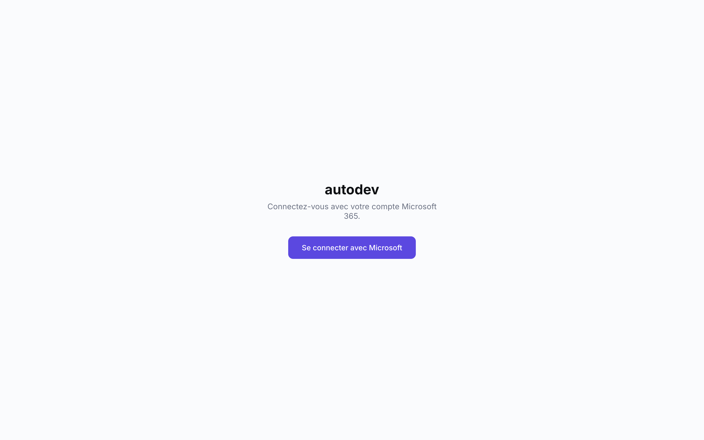

Cliquez sur **Se connecter avec Microsoft** et terminez la connexion avec votre compte Modulotech habituel. Vous arrivez ensuite directement sur le tableau de bord.

Votre identité et le lien **Se déconnecter** apparaissent en bas du menu de gauche, sous une pastille qui reprend la première lettre de votre adresse mail.

\newpage

# Tableau de bord

C'est la page d'accueil — votre vision d'ensemble de ce qui se passe sur tous les projets.

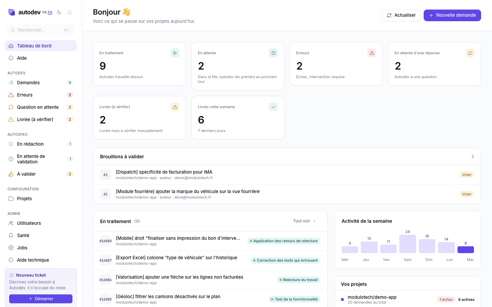

## Les indicateurs en haut

| Indicateur | Ce qu'il signifie |
|---|---|
| **En traitement** | Autodev travaille dessus en ce moment. |
| **En attente** | Dans la file, Autodev les prendra au prochain tour. |
| **Erreurs** | Demandes en échec — quelqu'un doit regarder et relancer. |
| **En attente d'une réponse** | Autodev a posé une question, il attend une réponse de votre part. |
| **Livrée (à vérifier)** | Livrée, mais Autodev a atteint une limite (corrections ou relectures) : la MR mérite un coup d'œil. |
| **Livrés cette semaine** | Tickets terminés sur les 7 derniers jours. |

Chaque carte est un raccourci vers la liste filtrée correspondante (l'onglet de même nom dans la liste des demandes).

## Les blocs

- **En traitement** — les 10 demandes sur lesquelles Autodev travaille actuellement. Chaque ligne montre le projet, le titre du ticket, et son état du moment.
- **Activité de la semaine** — un mini-graphe du nombre d'opérations menées chaque jour sur les 7 derniers jours, avec le chiffre affiché au-dessus de chaque barre. Utile pour repérer une journée creuse ou un pic.
- **Vos projets** — un récap par projet avec le nombre de demandes actives et le nombre d'erreurs en cours.
- **Brouillons à valider** — si vous êtes responsable d'un projet, ce bloc liste les brouillons de demande en attente de votre validation (que vous n'avez pas encore validés). Chaque ligne montre le titre, le projet, l'auteur, et un bouton **Voter** qui ouvre le brouillon.
- **Banderole d'alerte** — si au moins une demande est en échec, un bandeau rouge en bas vous le rappelle avec un lien direct.
- **Bandeau « Quota Claude épuisé »** — s'affiche en haut quand Autodev a temporairement épuisé son crédit de travail. Cela **ne veut pas dire qu'Autodev est en panne** : il arrête seulement de démarrer de nouvelles implémentations. Le suivi des demandes déjà en cours continue normalement — les tests qui passent au vert sont vus, les livraisons se font, les tickets clôturés sur GitLab sont détectés. Vos demandes en attente repartent d'elles-mêmes dès que le crédit revient, vous n'avez rien à faire.

## Le menu de gauche

Présent sur toutes les pages, organisé en sections :

- En haut (sans titre) : **Tableau de bord** (cette page) et **Aide** (ce guide).
- **Autodev** — le suivi des demandes confiées à Autodev :
  - **Demandes** — la liste complète des tickets.
  - **Erreurs** — les demandes en échec à relancer.
  - **Question en attente** — les demandes où Autodev attend une réponse de votre part.
  - **Livrée (à vérifier)** — les demandes livrées qui méritent un coup d'œil.
  - **Déploiement review** — déployer un environnement de review pour n'importe quelle *Merge Request* ouverte, même une que vous n'avez pas confiée à Autodev (voir *Déployer un environnement de review*).
- **AutoSpec** — vos brouillons de demandes rédigés avec l'aide d'Autodev (voir *Rédiger une demande avec Autodev*) :
  - **En rédaction** — vos brouillons en cours d'écriture.
  - **En attente de validation** — vos brouillons envoyés, en attente du vote des responsables.
  - **À valider** — les brouillons qui attendent **votre** vote (si vous êtes responsable d'un projet).
- **Configuration** — **Projets**, la liste des projets suivis.
- **Admin** — réservé aux administrateurs (gestion des utilisateurs, santé, etc.).

La plupart des entrées affichent un compteur à jour. Tout en bas du menu : votre identité connectée et le lien **Se déconnecter**.

## Les options en haut à droite

- Le sélecteur **FR / EN** pour changer la langue de l'interface.
- Un bouton **soleil / lune** pour basculer entre thème clair et thème sombre. Le choix est mémorisé sur votre navigateur.
- Un bouton **Actualiser** pour relancer une mise à jour du contenu.
- Un bouton **Nouvelle demande** qui ouvre l'éditeur pour rédiger une demande avec Autodev (voir *Rédiger une demande avec Autodev*).

Le tableau de bord se rafraîchit tout seul : pas besoin de recharger pour voir les changements arriver.

\newpage

# Liste des demandes

Toutes les demandes suivies par Autodev, sur tous les projets confondus.

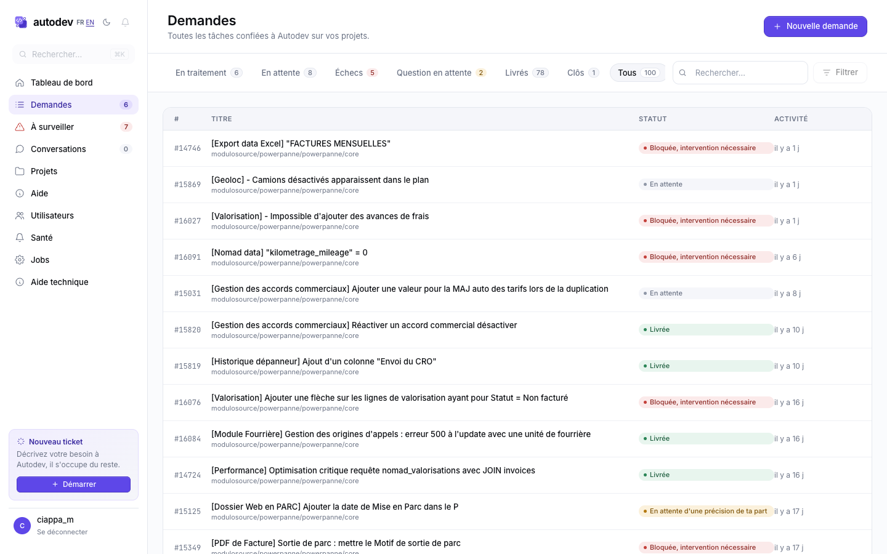

## Les onglets

| Onglet | Ce qu'il contient |
|---|---|
| **En traitement** | Tout ce qu'Autodev est en train de faire. |
| **En attente** | Les tickets pris en compte mais pas encore démarrés. |
| **Erreurs** | Les demandes en échec, à relancer. |
| **Question en attente** | Les demandes où Autodev attend une précision de votre part. |
| **Livrée (à vérifier)** | Les demandes livrées qui ont atteint une limite et méritent une vérification manuelle. |
| **Livrés** | Les tickets terminés. |
| **Clôs** | Les tickets mis de côté sans être livrés : clôturés à la main depuis Autodev, ou clôturés directement sur GitLab. |
| **Tous** | Aucun filtre — l'historique complet. |

Le compteur à côté de chaque onglet est mis à jour en direct. Trois de ces onglets — **Erreurs**, **Question en attente** et **Livrée (à vérifier)** — n'affichent pas une simple liste mais des **cartes** qui expliquent ce qui s'est passé et ce que vous devez faire (voir *Les demandes qui ont besoin de vous* ci-dessous).

## Pour chaque ligne

- L'identifiant interne (par exemple `#15124`).
- Le titre du ticket GitLab.
- Le chemin du projet.
- **Le nom de la personne qui a fait la demande** (repris de GitLab), affiché sous le titre. On le retrouve aussi sur les cartes mobiles et sur les cartes des onglets *Erreurs*, *Question en attente* et *Livrée (à vérifier)*.
- L'état actuel sous forme de pastille colorée.
- La date de la dernière activité.

Cliquez sur une ligne pour voir le **détail** de la demande (timeline complète, actions disponibles).

## Recherche et filtres

- **Champ de recherche** (en haut à droite) : tape un mot-clé, le titre et la description sont fouillés.
- **Filtre par dates** : permet de restreindre à une période.

\newpage

# Les demandes qui ont besoin de vous

Tout ce qui demande votre attention vit dans **trois onglets de la liste des demandes** — chacun aussi accessible en un clic depuis le menu de gauche (section *Autodev*) et depuis les indicateurs du tableau de bord :

- **Erreurs** — les demandes en échec.
- **Question en attente** — les demandes où Autodev attend une réponse de votre part.
- **Livrée (à vérifier)** — les demandes livrées qui méritent une vérification manuelle.

Dans ces trois onglets, chaque demande s'affiche sous forme de **carte** qui explique d'abord ce qu'il s'est passé — et ce que vous devez faire.

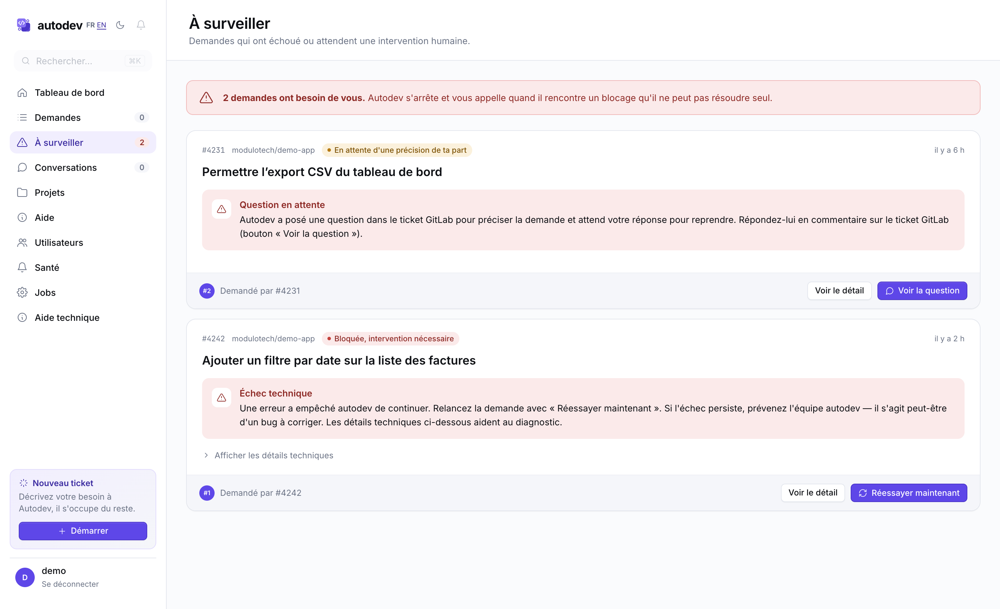

## Ce que chaque carte vous dit de faire

La réponse attendue dépend de la situation :

- **Échec technique** (onglet *Erreurs*) — *« Une erreur a empêché autodev de continuer. »* C'est probablement un bug d'Autodev lui-même. Avant d'agir, laissez-lui sa chance : Autodev **réessaie tout seul**, et redonne même une seconde chance espacée d'une heure à une demande dont les tentatives sont épuisées — beaucoup de ces échecs sont passagers (coupure réseau, GitLab indisponible) et se résorbent sans vous. Si la demande est toujours en échec après ça, relancez-la avec **Réessayer maintenant** ; si l'échec persiste, **prévenez l'équipe autodev** (les *détails techniques* sont utiles à transmettre). Vous n'avez rien à corriger côté ticket.
- **Question en attente** (onglet *Question en attente*) — *« Autodev a posé une question pour préciser la demande. »* Là, c'est à **vous de répondre** : Autodev a posté une question dans le ticket GitLab et attend votre réponse pour reprendre. **Répondez-lui en commentaire sur le ticket GitLab** (le bouton **Voir la question** vous y emmène directement). Tant que personne ne répond, la demande reste en attente.
- **Intervention manuelle requise** (onglet *Livrée (à vérifier)*) — la demande a été **livrée**, mais Autodev a atteint une limite (trop de corrections de pipeline ou de tours de relecture) et l'a livrée telle quelle. **Vérifiez la MR à la main** ; quand c'est bon, **Clôturer** la range. Quand le blocage vient d'un souci d'infrastructure (un job qui échoue en boucle), la carte indique désormais **le ou les jobs en cause** (par exemple *deploy_review*) pour vous aiguiller. Bonne nouvelle : dès que l'infrastructure est réparée et que les tests repassent au vert, Autodev **relance tout seul** ce genre de demande — vous n'avez en général rien à faire. Sous l'explication, la carte rappelle aussi **qui contacter** — un développeur du projet — pour finaliser la livraison.
- **La demande ne progresse plus** (onglet *Livrée (à vérifier)*) — *« La demande ne progresse plus et les vérifications automatiques n'ont pas permis de la relancer. »* Autodev a repéré tout seul qu'elle était à l'arrêt et a tenté plusieurs fois de la remettre en route, sans succès. **Allez voir le ticket sur GitLab** : la plupart du temps il n'est tout simplement plus d'actualité, et il suffit de le clôturer ou de retirer Autodev des assignés. Si le travail est toujours attendu, prévenez l'équipe autodev.

## Les actions sur chaque carte

- **Voir le détail** — ouvre la page détaillée du ticket.
- **Réessayer maintenant** (onglet *Erreurs*) — relance Autodev sur ce ticket. Si une *Merge Request* existe déjà, la demande reprend à sa vérification plutôt que de tout refaire.
- **Voir la question** (onglet *Question en attente*) — ouvre le ticket GitLab où Autodev a posé sa question, pour que vous y répondiez.
- **Clôturer** (onglet *Livrée (à vérifier)*) — range la demande une fois la MR vérifiée. Réservé aux personnes ayant accès au projet.

Si vous voulez voir ce qui s'est passé techniquement (pour faire suivre à un développeur, par exemple), le toggle **Afficher les détails techniques** déplie la trace :

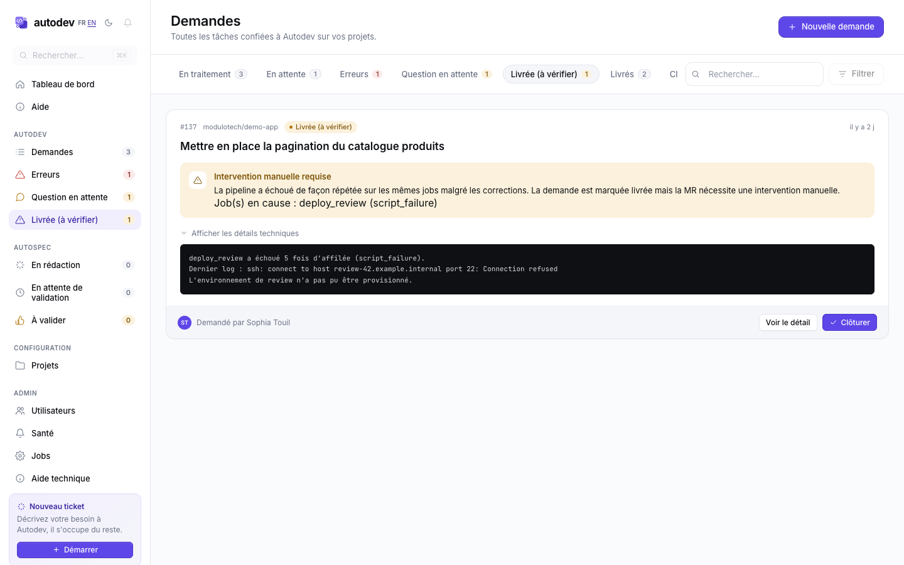

\newpage

# Détail d'une demande

La vue complète d'un ticket. Vous y arrivez en cliquant sur une ligne depuis n'importe quelle liste.

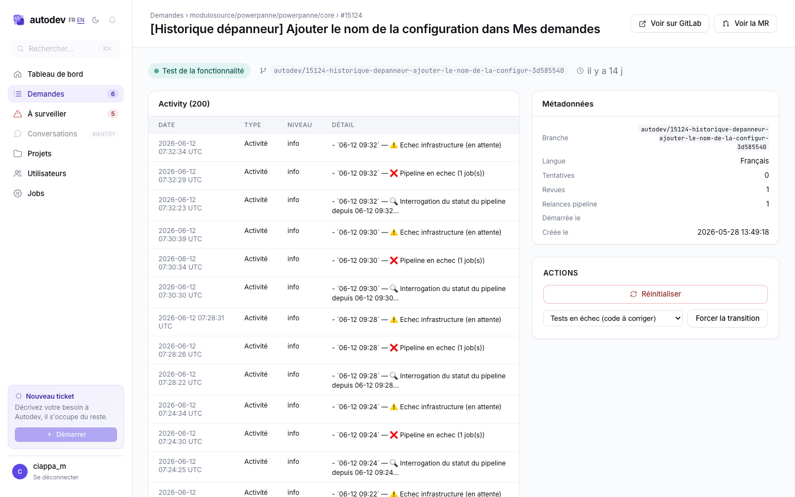

## En haut : l'en-tête

Le titre du ticket, l'état actuel sous forme de pastille, et deux raccourcis :

- **Voir sur GitLab** — ouvre le ticket d'origine.
- **Voir la MR** — ouvre la *Merge Request* (apparaît dès qu'Autodev l'a créée).

## Au centre : la chronologie

C'est le journal de bord. Chaque ligne est une étape de ce qu'Autodev a fait sur ce ticket — du clone initial jusqu'à la livraison, avec toutes les corrections intermédiaires.

Deux types d'entrées :

- **Étapes** — changements d'état (par exemple « passage de *Test de la fonctionnalité* à *Correction des tests qui échouent* »).
- **Actions** — événements détaillés : ouverture de la MR, échec d'un test, retentative, lancement d'une relecture, etc.

L'historique remonte les 200 dernières entrées par défaut.

## À droite : métadonnées et actions

**Métadonnées** :

- *Branche* — le nom de la branche créée par Autodev.
- *Langue* — la langue dans laquelle Autodev communique sur ce ticket.
- *Tentatives* — combien de fois Autodev a recommencé suite à une erreur.
- *Revues* — combien de fois la relecture automatique est passée.
- *Relances pipeline* — combien de fois la pipeline a été relancée.
- *Démarrée le* / *Créée le* — les horodatages.
- *Erreur* — le détail de l'erreur si la demande est bloquée.

**Actions** (varient selon l'état) :

- **Réinitialiser** — relance la demande. Si Autodev n'avait pas encore ouvert de *Merge Request*, elle repart de zéro ; s'il en avait déjà ouvert une, elle reprend à la vérification de la *Merge Request* existante plutôt que de tout refaire.
- **Forcer la transition** — fait passer manuellement la demande à l'étape suivante. Utile si vous voulez court-circuiter une attente.
- **Clôturer** — met la demande de côté sans la livrer. Elle bascule dans l'onglet *Clôs* et Autodev ne la reprend plus. Réservé aux personnes ayant accès au projet. Pour la relancer plus tard, utilisez *Réinitialiser*. Vous obtenez le même résultat en clôturant simplement le ticket sur GitLab : Autodev s'en aperçoit au tour suivant, range la demande dans *Clôs* et arrête le travail en cours. L'inverse n'est pas automatique — rouvrir le ticket sur GitLab ne relance pas Autodev, utilisez *Réinitialiser*.
- **Déployer / Redéployer la review** — déclenche le déploiement de l'environnement de review de la MR. Ce bouton est **toujours présent** sur la page d'une demande : tant qu'il n'y a pas encore de branche déployable, il apparaît **désactivé** avec la raison (par exemple *« L'issue n'a pas encore de branche »*), plutôt que d'être caché. Dès qu'une branche et un déploiement sont disponibles, il devient cliquable.

## Quand Autodev pose une question

Si Autodev a besoin d'une précision, l'écran change légèrement :

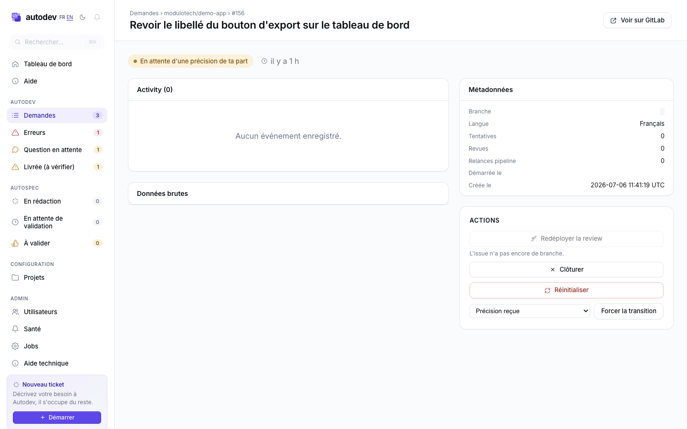

Répondez directement sur le ticket GitLab (commentaire). Autodev verra votre réponse au prochain tour. Si vous voulez accélérer le redémarrage, l'action **Précision reçue** est disponible dans le panneau **Actions**.

\newpage

# Déployer un environnement de review

Autodev peut déployer un **environnement de review** pour une *Merge Request*, même une MR qu'il ne suit pas (créée à la main par un développeur, en dehors du circuit Autodev). C'est utile pour prévisualiser une MR sans attendre qu'elle passe par Autodev.

On y accède par **Déploiement review** dans la section *Autodev* du menu de gauche.

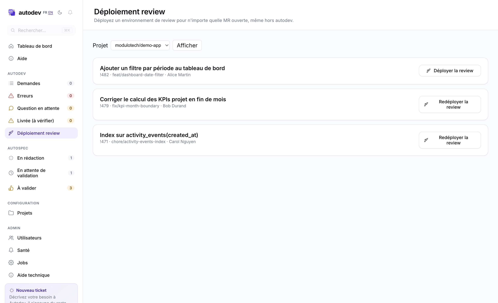

1. **Choisissez un projet** dans le sélecteur (seuls apparaissent les projets auxquels vous avez accès).
2. La page liste alors **toutes les MR ouvertes** du projet : titre, numéro, branche source et auteur.
3. Pour chacune, un bouton **Déployer / Redéployer** déclenche le déploiement de son environnement de review.

**Vous partez d'un numéro de ticket ?** C'est le cas le plus courant : vous avez un ticket en *Ready for QA* et vous voulez voir le résultat. Tapez simplement **son numéro** dans le champ de recherche (par exemple `16432`) et validez — la page ne garde que la ou les MR qui correspondent à ce ticket. Vous n'avez pas besoin de savoir quel numéro de MR lui correspond : Autodev fait le lien pour vous, y compris quand le nom de la branche ne porte pas le numéro du ticket. Le champ accepte aussi un **numéro de MR** ou **un mot du titre ou de la branche**.

Sur un projet actif, la liste peut dépasser la centaine de MR : c'est pour cela que la recherche existe. La case **Masquer les MR suivies par autodev** est l'autre raccourci — elle ne laisse que les MR créées à la main, celles pour lesquelles vous n'avez pas déjà une demande à suivre.

Les MR déjà suivies par Autodev sont signalées par un badge **Suivie par autodev** qui renvoie vers la demande correspondante ; elles restent listées (redéployer ne pose aucun problème).

Après un déploiement, la page revient sur **la même recherche** : vous ne repartez pas de la liste complète.

\newpage

# Projets

La liste des projets que suit Autodev.

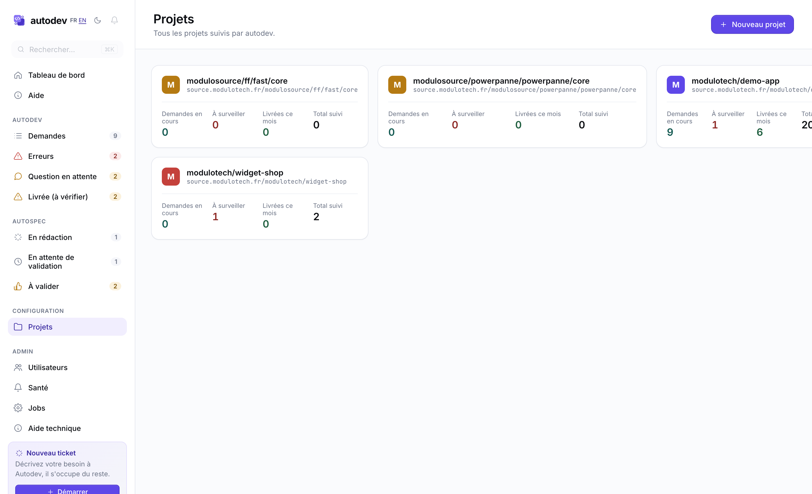

Chaque carte affiche, pour le projet :

- L'URL GitLab.
- Le nombre de **demandes en cours**.
- Le nombre de demandes **à surveiller**.
- Les demandes **livrées ce mois-ci**.
- Le **total** historique des demandes suivies.

Cliquez sur une carte pour ouvrir la page du projet.

## Détail d'un projet

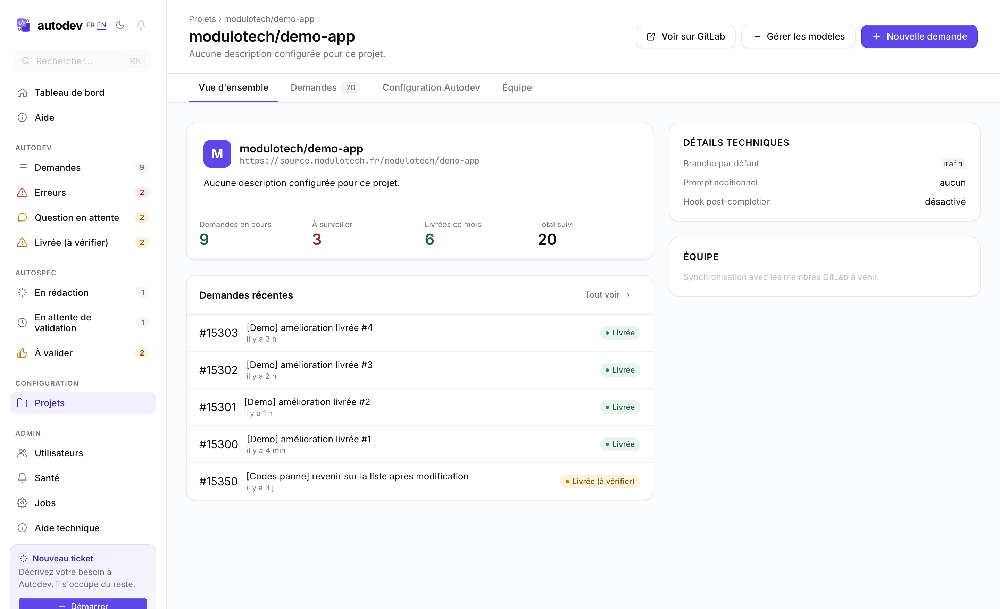

Quatre onglets en haut :

1. **Vue d'ensemble** — KPIs et les 5 demandes les plus récentes.
2. **Demandes** — la liste complète, préfiltrée sur ce projet.
3. **Configuration Autodev** — les réglages techniques du projet (à voir avec l'équipe technique).
4. **Équipe** — la gestion des **responsables (owners)** du projet : la liste des responsables actuels, avec la possibilité d'en **ajouter** (parmi les membres du projet) ou d'en **retirer**. Les responsables sont ceux qui valident les demandes rédigées dans AutoSpec (voir *Rédiger une demande avec Autodev*). Ajout et retrait réservés aux administrateurs et aux responsables déjà en place ; les autres membres voient la liste en lecture seule.

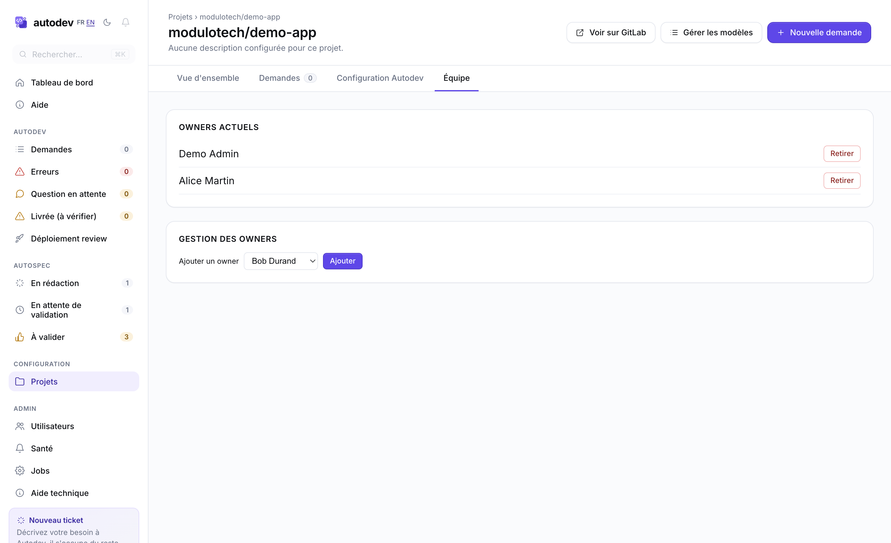

Le panneau de droite récapitule les **détails techniques** et l'**équipe**.

En haut à droite, **Voir sur GitLab** ouvre le projet GitLab.

\newpage

# Rédiger une demande avec Autodev

Pas besoin d'avoir déjà un ticket bien formulé : depuis le tableau de bord, vous pouvez **écrire une demande en discutant avec Autodev**, le laisser la mettre en forme, puis l'envoyer — à un développeur ou directement à Autodev — une fois qu'elle est validée.

On y accède par la section **AutoSpec** du menu de gauche, ou par le bouton **Nouvelle demande** en haut du tableau de bord.

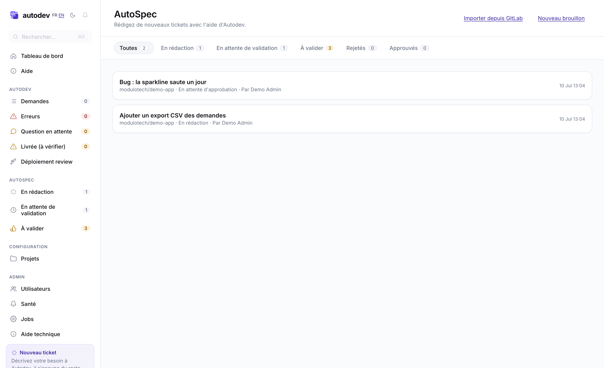

Chaque brouillon porte un titre, le projet concerné, son état (en rédaction, en attente de validation, rejeté, ou approuvé), et **le nom de son auteur** — utile surtout dans l'onglet *À valider*, où vous voyez des brouillons rédigés par d'autres. La liste est organisée en onglets :

| Onglet | Ce qu'il contient |
|---|---|
| **Toutes** | Tous vos brouillons, quel que soit leur état. |
| **En rédaction** | Vos brouillons en cours d'écriture. |
| **En attente de validation** | Vos brouillons envoyés, en attente du vote des responsables. |
| **À valider** | Les brouillons qui attendent **votre** vote (si vous êtes responsable d'un projet) — y compris ceux écrits par d'autres. C'est ici, et non plus seulement sur le tableau de bord, que vous retrouvez ce que vous devez valider. |
| **Rejetés** | Vos brouillons refusés (à corriger puis renvoyer). |
| **Approuvés** | Vos brouillons validés et envoyés sur GitLab. |

## Démarrer un brouillon

Deux possibilités :

- **Nouveau brouillon** — vous choisissez le projet concerné, et vous pouvez donner un titre et un début de description (ou partir d'une page blanche).
- **Importer depuis GitLab** — collez l'adresse d'un ticket GitLab existant : son titre et son contenu pré-remplissent un nouveau brouillon, que vous pouvez ensuite retravailler. L'adresse fonctionne, que le ticket s'ouvre dans l'ancienne ou la nouvelle vue de GitLab.

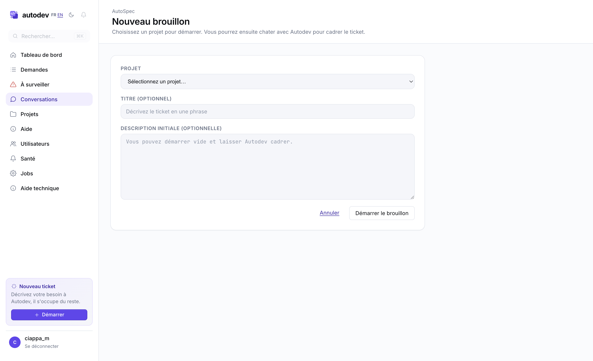

Si le projet a des **modèles de ticket** (par exemple *Évolution* ou *Bug*), un sélecteur vous laisse en choisir un : sa structure pré-remplit la description, et Autodev s'appuiera dessus pour vous aider à la compléter. À défaut de modèle, Autodev part d'une structure générale (Contexte, Comportement attendu, Critères d'acceptation, Notes). Voir *Les modèles de ticket* plus bas.

## Autodev évalue d'emblée votre brouillon

Dès qu'un brouillon est créé avec un minimum de contenu (un titre ou une description, ou un ticket importé), Autodev ouvre la conversation tout seul par une **évaluation de la qualité du ticket** : ce qui est clair, ce qui manque (contexte, comportement attendu, critères d'acceptation…), et la première question à laquelle répondre pour avancer. Si un modèle de ticket est choisi, l'évaluation indique aussi en quoi le brouillon respecte ou non ce modèle. Un brouillon parti d'une page blanche n'est pas évalué (il n'y a encore rien à juger).

## Discuter pour mettre en forme

L'éditeur a deux colonnes : à gauche votre demande en cours de rédaction, à droite la conversation avec Autodev.

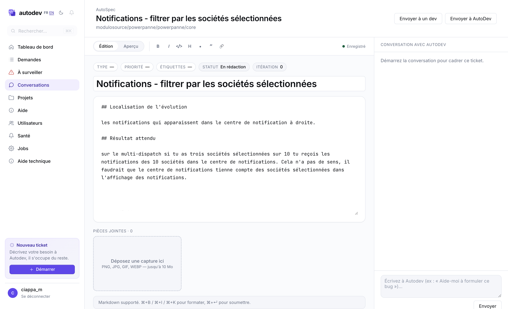

- **Écrivez à Autodev** ce que vous voulez (« Aide-moi à décrire ce bug », « Reformule pour un développeur »…). Il connaît le projet visé et propose un texte que vous pouvez accepter d'un clic.
- **Le texte de la demande** se construit à gauche ; vous pouvez aussi l'éditer vous-même à tout moment.
- **Quelques étiquettes** (type, priorité, mots-clés) aident à cadrer la demande.
- **Des captures d'écran** peuvent être ajoutées par glisser-déposer pour illustrer le besoin.

## Envoyer la demande

Quand la demande vous convient, envoyez-la avec le bouton d'envoi situé en haut de l'éditeur. Son libellé indique directement la destination :

- **Envoyer à un dev** — le ticket est créé sur GitLab pour qu'un développeur s'en occupe.
- **Envoyer à Autodev** — le ticket est créé *et* confié à Autodev, qui le prendra en charge automatiquement.

Les responsables du projet voient les deux boutons et choisissent la destination ; les autres membres voient uniquement **Envoyer à un dev**.

## La validation

Une demande envoyée passe d'abord par une **validation des responsables du projet**. Tant que tout le monde n'a pas approuvé, elle reste **en attente d'approbation**.

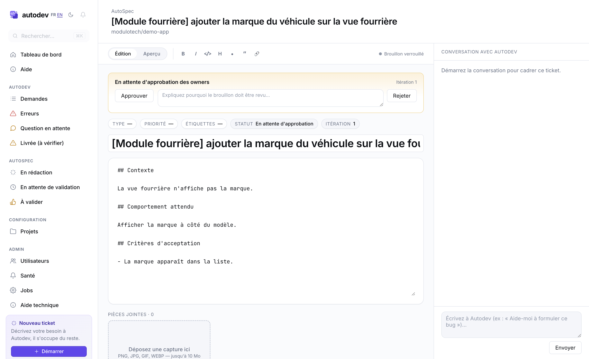

- Si un responsable **refuse**, il laisse un motif et la demande revient en rédaction pour être corrigée, puis renvoyée.
- Quand **tous** ont approuvé, le ticket est créé sur GitLab (et confié à Autodev si c'était la destination choisie).

Vous pouvez aussi **rétracter** un brouillon en attente pour le modifier avant qu'il soit validé.

Enfin, vous pouvez **supprimer** un brouillon tant qu'il n'a pas été envoyé sur GitLab — qu'il soit en rédaction, en attente de validation, ou rejeté. La suppression se fait depuis la page du brouillon, avec une confirmation, et est définitive. Une fois la demande envoyée (le ticket GitLab créé), elle ne peut plus être supprimée. L'action est réservée à l'auteur, à un responsable du projet, ou à un administrateur.

## Les modèles de ticket

Pour qu'Autodev rédige des tickets cohérents sur un projet, les responsables du projet peuvent définir un ou plusieurs **modèles** (par exemple *Évolution*, *Bug*). Chaque modèle décrit la structure attendue (les sections à remplir).

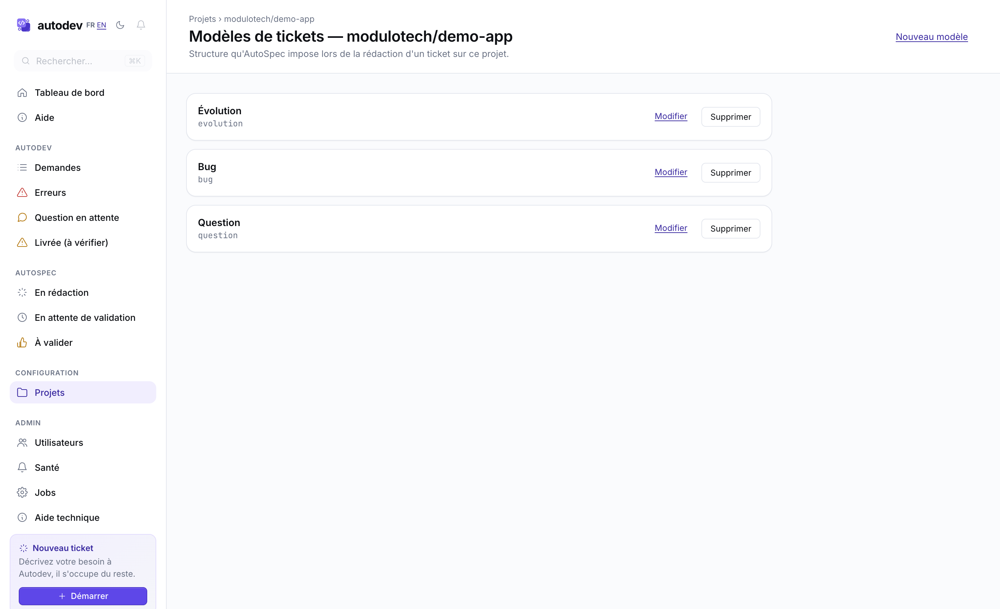

- On les gère depuis le bouton **Gérer les modèles**, sur la page du projet (et depuis la page de configuration du projet).
- À la création d'un brouillon, le sélecteur de modèle pré-remplit la description avec la structure choisie.
- Pendant la rédaction, Autodev suit le modèle retenu et signale les sections manquantes. Si vous n'avez pas choisi de modèle alors que le projet en propose, il vous suggère le plus adapté.
- Si le projet n'a aucun modèle, Autodev utilise une structure générale par défaut.

\newpage

# Comprendre les pastilles d'état

Au fil des écrans, chaque demande porte une pastille colorée qui indique où elle en est. Voici la signification :

| Pastille | Ce que ça veut dire |
|---|---|
| **En attente** | Dans la file, Autodev la prendra au prochain tour. |
| **Préparation** | Autodev récupère le code du projet. |
| **Compréhension de la demande** | Autodev lit le ticket et vérifie qu'il a tout pour démarrer. |
| **Écriture du code** | Autodev produit les modifications. |
| **Sauvegarde** | Autodev commit son travail. |
| **Envoi sur GitLab** | Autodev pousse la branche. |
| **Ouverture de la demande de fusion** | Création de la MR. |
| **Test de la fonctionnalité** | La pipeline GitLab tourne. |
| **Relecture du travail** | La relecture automatique est en cours. |
| **Application des retours de relecture** | Autodev intègre les remarques laissées sur la MR. |
| **Correction des tests qui échouent** | Autodev corrige les erreurs de la pipeline. |
| **Réponse à une question** | Autodev rédige sa réponse à une question. |
| **En attente d'une précision de ta part** | Autodev a posé une question, il attend votre réponse. |
| **Finalisation** | Dernières opérations après la livraison. |
| **Livrée** | Terminé, la MR est prête à merger. |
| **Livrée (à vérifier)** | Livrée, mais Autodev a atteint une limite (trop de corrections ou de relectures) : la MR a été livrée telle quelle et mérite un coup d'œil. |
| **Bloquée, intervention nécessaire** | Quelque chose a échoué, il faut regarder. |
| **Clôturée** | Mise de côté sans être livrée, à la main depuis Autodev ou en clôturant le ticket sur GitLab. |

\newpage

# Questions fréquentes

**Combien de temps avant qu'Autodev prenne ma demande en compte ?**
Autodev vérifie ses tickets toutes les quelques minutes. Le démarrage se fait donc en quelques minutes, pas en quelques secondes.

**Combien de tickets Autodev peut-il traiter en parallèle ?**
Plusieurs, mais pas en illimité. Si vous lui en confiez beaucoup d'un coup, certains attendront leur tour (visible sous *En attente*).

**Autodev a posé une question, comment je lui réponds ?**
Répondez directement sur le ticket GitLab en commentaire, comme à n'importe quel collègue. Il verra votre réponse au prochain tour.

**Une demande affiche *Échec technique*, qu'est-ce que je fais ?**
Relancez-la d'abord avec **Réessayer maintenant** (l'erreur est peut-être passagère). Si elle échoue de nouveau, c'est probablement un bug d'Autodev : **prévenez l'équipe autodev** et transmettez les *détails techniques* dépliés sur la carte. Rien à corriger de votre côté sur le ticket.

**Autodev s'est trompé ou a fait n'importe quoi, je peux annuler ?**
Oui, de trois façons. **Déplacez le label de suivi** du ticket sur GitLab (passez-le en revue, en recette, où vous voulez) : Autodev s'en aperçoit au tour suivant, arrête le travail en cours et vous laisse un commentaire sur le ticket pour confirmer qu'il a bien lâché la main. **Désassignez-le** du ticket : même effet, même commentaire. Ou ouvrez le détail de la demande et cliquez sur **Clôturer** pour la mettre de côté depuis le tableau de bord. Dans tous les cas vous pouvez ensuite assigner le ticket à un humain, et la MR déjà créée reste disponible — vous pouvez la fermer ou la modifier librement.

Une précision utile : remettre le label *{{label_todo|à traiter}}* n'arrête **pas** Autodev, c'est au contraire la façon de lui redemander du travail (voir plus bas).

**La MR n'est pas mergée, est-ce qu'il faut que je le fasse moi ?**
Oui. Autodev livre une MR prête à merger, mais le merge final reste à un humain (validation finale, déploiement, etc.).

**J'ai recetté la livraison et ce n'est pas bon, comment je lui demande de corriger ?**
Remettez le label *{{label_todo|à traiter}}* sur le ticket **et laissez un commentaire sur le ticket GitLab** expliquant ce qui ne va pas. Tant que la MR est encore ouverte, Autodev reprend le travail en tenant compte de votre commentaire et pousse la correction **sur la même MR** — inutile d'en rouvrir une. Le commentaire est indispensable : sans nouveau retour, il considère qu'il n'y a rien à changer.

**Une demande est bloquée en *Test de la fonctionnalité* depuis longtemps. Pourquoi ?**
C'est généralement une pipeline d'infra (pas un bug du code) qui a échoué de façon répétée. La demande bascule alors en *Livrée (à vérifier)*, et la carte vous indique le job en cause. Autodev **retente automatiquement** une fois l'infrastructure réparée (les tests repassés au vert) : la plupart du temps il n'y a donc rien à faire. Si le souci persiste, ouvrez le détail, regardez les **détails techniques**, et faites suivre à l'équipe technique.

**Est-ce qu'Autodev peut surveiller une demande indéfiniment ?**
Non, plus depuis cette version. Si Autodev surveille les tests d'une demande pendant **14 jours sans jamais arriver à conclure**, il arrête de la surveiller : elle bascule en *Livrée (à vérifier)* et il laisse un commentaire sur le ticket pour le dire. La MR reste ouverte, rien n'est perdu — c'est à un humain de reprendre. Ça évite les demandes qu'Autodev surveillait depuis des semaines sans que personne ne le sache. Une panne temporaire (GitLab injoignable, quota Claude épuisé) ne compte pas comme une surveillance sans résultat : dans ce cas Autodev garde la demande et réessaie au cycle suivant.

**Qui peut valider les demandes AutoSpec d'un projet, et comment sont désignés les responsables ?**
Les **membres** d'un projet sont synchronisés automatiquement depuis GitLab : toute personne ayant accès au dépôt devient contributeur. Les **responsables (owners)** — ceux qui valident les demandes rédigées dans AutoSpec — sont désignés **à la main**, dans l'onglet *Équipe* de la page du projet, par un administrateur ou un responsable déjà en place. La synchronisation GitLab ne touche jamais à cette liste. Tant qu'aucun responsable n'a été désigné sur un projet, un administrateur doit poser le premier.

**Et le hook *post-completion* qui apparaît parfois en erreur ?**
C'est une action de finalisation après livraison (par exemple, mise à jour d'un changelog). Si elle échoue, la demande reste tout de même livrée — mais elle apparaîtra dans l'onglet **Livrée (à vérifier)** pour signaler le problème de finalisation.
