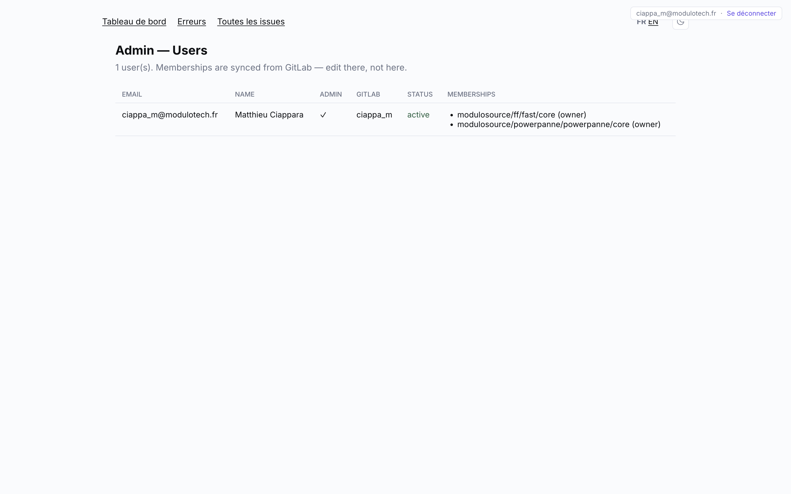
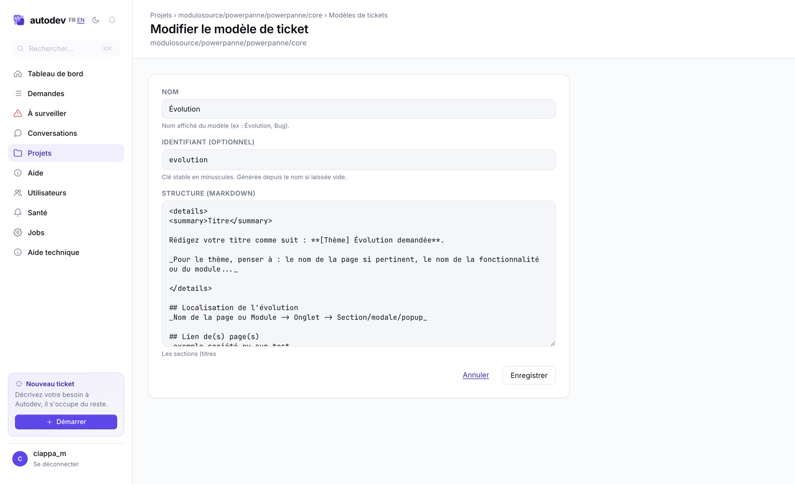

\newpage

# À qui s'adresse ce document

Ce guide complète le [guide utilisateur](autodev-functional-usage.md) en couvrant tout ce qui n'a pas sa place dans une doc destinée aux non-techniciens : routes admin, configuration des projets dans `~/.autodev/config.yml`, ligne de commande, machine à états AASM, et catalogue des erreurs.

Public visé : administrateurs de la plateforme Autodev, développeurs intervenant sur le code Autodev, ops chargés de maintenir l'instance en production.

L'instance prod tourne sur `https://autodev.netbird.modulotech.fr`, derrière le SSO Microsoft 365 (Entra ID via Devise + OmniAuth, formulaire CSRF-protégé sur `/sign_in`). Architecture : Rails 8.1 + Solid Queue, SQLite multi-DB (`~/.autodev/autodev.db` + `~/.autodev/autodev_queue.db`), supervisor `bin/autodev` qui fork `bin/rails server` + `bin/jobs start`.

\newpage

# Routes du dashboard

| Route | Contrôleur | Description |
|---|---|---|
| `/` | `DashboardController#show` | KPIs, listes actives, sparkline, banderole erreurs |
| `/issues` | `IssuesController#index` | Liste paginée + filtrable (`?tab=`, `?q=`, `?from=`, `?to=`) |
| `/issues/:id` | `IssuesController#show` | Détail + activity events (200 derniers) |
| `/issues/:id.json` | `IssuesController#show` | Mêmes données, format JSON |
| `/issues/:id/reset` (POST) | `IssuesController#reset` | Reset brut (raw SQL, pas une transition AASM) |
| `/issues/:id/transition` (POST) | `IssuesController#transition` | Déclenche un événement AASM (`?event=...`) |
| `/issues/:id/close` (POST) | `IssuesController#close` | Clôture manuelle (événement AASM `close`, gatée sur le membership projet) — `closed` depuis n'importe quel état |
| `/errors` | `ErrorsController#index` | Issues en `error` + `needs_clarification` + `post_completion_error IS NOT NULL` |
| `/projects` | `ProjectsController#index` | Union des rows `projects` + entrées YAML pas encore importées |
| `/projects/new` (+ POST `create`) | `ProjectsController#new`/`#create` | Création d'un projet en base (admin only) — enfile `SyncGitlabMembershipsJob` au succès |
| `/projects/:slug/edit` (+ PATCH `update`) | `ProjectsController#edit`/`#update` | Édition de la config per-projet en base (gatée membership/admin) |
| `/projects/:slug/ticket_templates` (index/new/create) | `TicketTemplatesController` | Modèles de ticket AutoSpec du projet (gaté membership/admin, 404 si pas de row projet) |
| `/projects/:slug/ticket_templates/:id` (edit/update/destroy) | `TicketTemplatesController` | Édition / suppression d'un modèle (`:id` numérique) |
| `/projects/:slug` | `ProjectsController#show` | Slug = `group/sub/name` encodé en `group__sub__name` |
| `/stream` | `StreamController#show` | Server-Sent Events, `ActionController::Live` |
| `/locale/:lang` | `LocaleController#update` | Set le cookie `locale`, redirige sur `back` |
| `/autospec_drafts` | `AutospecDraftsController#index` | Brouillons de l'utilisateur courant (AutoSpec) |
| `/autospec_drafts/new` (+ POST `create`) | `AutospecDraftsController` | Formulaire de création + persistance |
| `/autospec_drafts/import` (+ POST `create_from_import`) | `AutospecDraftsController` | Backfill depuis une URL d'issue GitLab |
| `/autospec_drafts/:id` | `AutospecDraftsController#show` | Éditeur + chat + bandeau d'approbation |
| `/autospec_drafts/:id` (PATCH) | `AutospecDraftsController#update` | Autosave titre/markdown/meta_chips (409 hors `drafting`) |
| `/autospec_drafts/:id/chat` (POST) | `AutospecDraftsController#chat` | Tour de chat (`Autospec::Chat`), 503 si clé Anthropic absente |
| `/autospec_drafts/:id/apply_suggestion` (POST) | `AutospecDraftsController#apply_suggestion` | Applique un `tool_use` proposé par le modèle |
| `/autospec_drafts/:id/{submit_for_approval,retract,approve,reject}` (POST) | `AutospecDraftsController` | Workflow d'approbation (§J) |
| `/autospec_drafts/:id/autospec_attachments` (POST + DELETE `:id`) | `AutospecAttachmentsController` | Pièces jointes image (ActiveStorage, ≤ 10 Mo) |
| `/help` | `HelpController#show` | Guide utilisateur rendu (`HelpDoc.render(:functional)`) |
| `/help/images/:filename` | `HelpController#image` | Captures d'écran des deux guides (partagé) |
| `/users/auth/entra_id` (+ callback) | Devise | OmniAuth Microsoft 365 |
| `/users/sign_out` (DELETE) | `Users::SessionsController#destroy` | Sign-out custom — `devise_for :users` n'émet pas la ressource `sessions` (le model `User` n'a pas `:database_authenticatable`), ce contrôleur comble le trou |
| `/sign_in` | `SignInController#new` | Page d'atterrissage avec form POST CSRF |
| `/admin/users` | `Admin::UsersController#index` | Audit users + memberships (admin only) |
| `/admin/health` | `Admin::HealthController#show` | Tableau de bord santé système (admin only) |
| `/admin/help` | `Admin::HelpController#show` | Ce guide technique rendu (`HelpDoc.render(:technical)`, admin only) |
| `/admin/jobs` | Mission Control | Inspecteur Solid Queue (admin only) |
| `/up` | `Rails::HealthController#show` | Liveness (le process répond) — **non authentifié** |
| `/healthz(.json)` | `MonitoringController#show` | Santé JSON pour sondes externes, HTTP 200/503 — **non authentifié** |
| `/healthz/:check` | `MonitoringController#component` | Un seul composant (`poller`, `workers`, `queue`, …) — **non authentifié** |

Toutes les routes hors `/sign_in`, SSO et les endpoints de monitoring (`/up`, `/healthz*`) sont gatées par le `before_action :authenticate_user!` global (PR3 du chantier *users-rollout*). Les routes `/admin/*` ajoutent un check `current_user&.admin?` au-dessus. Les endpoints de monitoring sautent volontairement le gate (une sonde externe ne peut pas faire le handshake SSO) — voir `docs/observability.md`.

Pas de chrome custom sur `/admin/jobs` — c'est l'UI fournie par la gem `mission_control-jobs`.

## Comportement temps réel

- `/stream` est une long-lived SSE. Tout `ActivityEvent` créé est publié sur `Web::EventBus` (in-process pub/sub, backpressure drop à 100), puis transformé en Turbo Stream HTML envoyé sur la connexion ouverte.
- Le layout Phlex ouvre une `EventSource('/stream')` au `turbo:load`. Désactivé sous `navigator.webdriver` pour ne pas bloquer les outils d'automation qui attendent `networkidle`.
- Listener `pagehide` côté client : ferme l'`EventSource` à chaque F5 / fermeture d'onglet / navigation cross-document, pour que le thread Puma parqué sur `Queue#pop` soit libéré au prochain write au lieu d'attendre le heartbeat. `StreamController::HEARTBEAT_INTERVAL = 5` secondes en filet de sécurité pour les morts silencieuses (kill navigateur, perte réseau, sleep machine). Voir `docs/autospec.md` §L pour le contexte et les critères pour migrer vers ActionCable + Solid Cable à l'implem AutoSpec.

\newpage

# Admin — Utilisateurs

URL `/admin/users`. Audit lecture seule de la table `users` et de la table `project_memberships`. Accès restreint aux comptes avec `admin = true`.



Colonnes :

- **Email** — identifiant SSO ;
- **Name** — nom complet remonté par Entra ID ;
- **Admin** — `users.admin = true` (donne accès à `/admin/*`) ;
- **GitLab** — `users.gitlab_username` (résolu par la synchro) ;
- **Status** — `active` ou `inactive` (rebasculé selon les memberships GitLab) ;
- **Memberships** — entrées de `project_memberships`, rôle `owner` ou `contributor`.

Les memberships sont dérivés d'une synchro GitLab (commande CLI `--sync-memberships`). Pas d'édition manuelle depuis l'UI : la sync GitLab fait foi. Pour bootstrapper le premier admin, utiliser `autodev --seed-admin EMAIL`.

\newpage

# Mission Control — Jobs

URL `/admin/jobs`. UI de la gem `mission_control-jobs` montée sur l'app Rails, branchée sur Solid Queue.


Sections :

- **Queues** — `default` et `solid_queue_recurring`.
- **Failed jobs** — devrait toujours être à 0. Un job en échec ici = un bug à diagnostiquer.
- **In Progress jobs** — les jobs en cours d'exécution.
- **Blocked jobs** — concurrence sérialisée (cf. `IssueProcessJob#limits_concurrency`).
- **Scheduled jobs** — jobs programmés via `enqueue_at`.
- **Finished jobs** — historique (5K+ en prod).
- **Workers** — les workers Solid Queue actifs (forks de `bin/jobs start`).
- **Recurring tasks** — programmées via `config/recurring.yml` : `AutodevPollJob` (poll, `*/N * * * *`), `SyncGitlabMembershipsJob` (réconciliation memberships, `0 3 * * *`), `RefreshProjectBriefingsJob` (briefing AutoSpec horaire, `0 * * * *`), et **en prod uniquement** `clear_solid_queue_finished_jobs` (purge horaire des jobs terminés, minute 12), `LogJanitorJob` (`prune_logs`, rotation/purge des logs, `30 4 * * *`) et `ReapFailedJobsJob` (`reap_transient_failed_jobs`, écarte les échecs process transitoires, `18 * * * *`). Le bloc `development:` est vide — un supervisor local n'auto-poll pas.

À vérifier en cas de souci :

1. Le worker Solid Queue tourne (sinon les `AutodevPollJob` ne s'enquilleraient pas).
2. La tâche récurrente `AutodevPollJob` est bien programmée à l'intervalle attendu.
3. Aucun job n'est resté bloqué en *In Progress* après un crash supervisor.
4. La file *Failed jobs* est vide.

Auth : `current_user&.admin?` requis (cf. `config/initializers/mission_control.rb`).

\newpage

# Admin — Santé du système

URL `/admin/health`. Tableau de bord passif (aucune sonde active : pas de shell-out danger-claude, pas d'appel GitLab au chargement) qui agrège l'état du système via `Autodev::HealthReport`. Accès restreint aux comptes `admin = true`.

Une carte par composant, avec une pastille `OK` / `Attention` / `Hors service` :

- **Poller** — fraîcheur du dernier heartbeat (`ActivityEvent` `kind: 'poller'`). `Hors service` si plus vieux que `poll_interval × monitoring.poll_stale_factor` (plancher 15 min).
- **Workers** — process Solid Queue vivants (heartbeat < 5 min).
- **File de jobs** — jobs en échec / en attente (Solid Queue).
- **Quota Claude** — dernier état connu du `UsageChecker` (lu sur le dernier heartbeat, pas re-sondé).
- **Issues en erreur** — nombre d'issues `error` / `post_completion_error` (lien vers `/errors`).
- **Base de données** — primaire + queue joignables.

Les mêmes données sont servies en JSON sur `/healthz` (HTTP 503 uniquement si `down` — vraie panne ; `ok` et `warn` renvoient 200) pour brancher des sondes Datadog / BetterStack. Référence complète (endpoints, heartbeat, configuration, exemples de sondes, TODO) : **`docs/observability.md`**.

\newpage

# Configuration d'un projet

Depuis le task #9 (phases 3-4, `v1.0.0-alpha.25`/`.26`), la config par projet vit **en base**, sur la row `projects`, et s'édite depuis le dashboard. Le bloc `projects:` de `~/.autodev/config.yml` **n'est plus requis** : `~/.autodev/config.yml` ne sert plus que pour les credentials (`gitlab_token`, bloc `azure:`) et comme fallback transitoire pour les projets pas encore importés en base.

## Créer / éditer un projet

- **Créer** : `GET /projects/new` + `POST /projects` (`ProjectsController#new/#create`), **admin uniquement** (`can_create_project?`). `gitlab_path` (immuable) dérive le `slug`/`name`, `default_locale` fixe la langue des commentaires. Au succès, `SyncGitlabMembershipsJob` est enfilé pour peupler les memberships.
- **Éditer** : `GET /projects/:slug/edit` + `PATCH /projects/:slug` (`ProjectsController#edit/#update`), gaté **admin ou collaborateur** du projet (`can_edit_project?` → `current_user.contributor_of?`). Une row `projects` doit exister (sinon 404). Seules les colonnes de config sont persistées (jamais de mass-assignment) ; un champ vidé retombe sur le défaut global.


## Champs de config (formulaire `/projects/:slug/edit`)

| Section | Champ | Effet |
|---|---|---|
| Général | `target_branch` | Branche cible des MRs (défaut : branche par défaut du dépôt). |
| Général | `labels_todo` / `label_doing` / `label_done` | Les 3 labels du cycle de vie GitLab (listes, une entrée par ligne). |
| Général | `extra_prompt` | Texte ajouté à tous les prompts `danger-claude` du projet. |
| Exécution | `dc_timeout` | Délai max d'un appel `danger-claude` (s). |
| Exécution | `max_retries` | Nb max de tentatives sur échec. |
| Exécution | `retry_backoff` | Délai de base entre deux tentatives (s). |
| Exécution | `stagnation_threshold` | Échecs identiques consécutifs avant abandon. |
| Exécution | `clone_depth` | Profondeur du `git clone` (0 = historique complet). |
| Exécution | `sparse_checkout` | Chemins du sparse checkout (liste, pour monorepos). |
| Exécution | `post_completion` | Commande(s) lancée(s) après livraison (sur désassignation). |
| Exécution | `post_completion_timeout` | Délai max de la commande `post_completion` (s). |
| Avancé | `model` | Modèle `danger-claude` (option `-m`). |
| Avancé | `effort` | Effort de raisonnement `danger-claude` (option `-e`). |
| Avancé | `parallel_agents` | Découpe les issues complexes sur plusieurs agents (worktrees git). |
| Avancé | `split_implementation` | Implémente code puis tests en deux passes distinctes. |
| Avancé | `implementer_agent` / `test_writer_agent` / `mr_fixer_agent` | Agents custom (nom ou chemin dans `.claude/agents`). |

Les commandes d'environnement (`setup`/`test`/`lint`/`run`) vivent à part dans la table `project_app_commands` (sous-bloc `app:` en YAML), reconstruites par `Project#to_project_config`. Le `run` avec au moins un `port` auto-active Chrome DevTools pour les captures d'écran. Tri-état des booléens : *Défaut* (suit le global) / *Activé* / *Désactivé*.

## Résolution DB vs YAML

`IssueProcessJob#lookup_project_config` résout dans cet ordre :

1. **Row `projects`** → `Project#to_project_config` (autoritaire ; n'émet que les clés présentes, se superpose proprement aux défauts globaux).
2. **Fallback YAML** : entrée `projects:` de `config.yml` correspondant au path, si aucune row.
3. Ni l'un ni l'autre → l'issue est skippée.

`Project.runtime_configs` (discovery côté poller / boot) fait la même union DB-puis-YAML. Pour migrer un bloc `projects:` YAML en base : `bin/rails autodev:migrate_projects_from_yaml` (transactionnel, `DRY_RUN=1` pour un essai à blanc).

## Synchronisation GitLab

Les memberships sont alimentés par `autodev --sync-memberships` (manuel ou via la tâche planifiée `0 3 * * *`).

Attention : un `--sync-memberships` lancé sur une base `projects` vide désactive silencieusement tous les users. Toujours vérifier `Project.count > 0` avant de lancer la sync.

\newpage

# Outils en ligne de commande

Le binaire `autodev` est à la fois le supervisor (par défaut, démarre Rails + Solid Queue) et une CLI qui lit/mute la base SQLite directement (sans passer par le worker).

## Supervisor

| Commande | Effet |
|---|---|
| `autodev` | Lance le supervisor (Rails + worker Solid Queue), foreground. |
| `brew services start autodev` | Idem mais via launchd, logs dans `~/.autodev/log/`. |
| `autodev -c PATH` | Utilise un fichier de config alternatif. |
| `autodev -n N` | Force le nombre de workers Solid Queue (`AUTODEV_MAX_WORKERS`). |
| `autodev -i SECONDS` | Force l'intervalle de poll (`AUTODEV_POLL_INTERVAL`). |

## CLI directe (lit/écrit la DB et exit)

| Commande | Effet |
|---|---|
| `autodev --status` | Tableau ASCII des demandes suivies (non `done`). |
| `autodev --status --all` | Inclut les demandes `done`. |
| `autodev --errors` | Détail des demandes en `error`. |
| `autodev --errors IID` | Détail d'une demande spécifique. |
| `autodev --reset` | Reset toutes les demandes `error` vers `pending`. |
| `autodev --reset IID` | Reset une demande. |
| `autodev --seed-admin EMAIL` | Crée un compte admin local (bootstrap initial). |
| `autodev --sync-memberships` | Synchronise `project_memberships` depuis GitLab. |
| `autodev --link-user EMAIL,GITLAB_USERNAME` | Override manuel du `gitlab_username` d'un user. |
| `autodev --version` | Version courante. |

## Polling forcé

```bash
bin/rails runner 'AutodevPollJob.perform_now'
```

Exécute un cycle de poll complet de façon synchrone, en réutilisant le code du job. Utile pour debugger sans attendre le tick suivant.

## Variables d'environnement

| Variable | Effet |
|---|---|
| `GITLAB_API_TOKEN` | Token GitLab personal (requis). |
| `GITLAB_URL` | Override de l'URL GitLab (défaut `https://gitlab.com`). |
| `AUTODEV_HOME` | Racine de l'état sur disque (défaut `~/.autodev`). |
| `AUTODEV_DB` | Path SQLite primaire. |
| `AUTODEV_QUEUE_DB` | Path SQLite Solid Queue. |
| `AUTODEV_MAX_WORKERS` | Threads Solid Queue (défaut 3). |
| `AUTODEV_POLL_INTERVAL` | Intervalle de poll en secondes (défaut 300). |

\newpage

# Machine à états (AASM)

Le modèle `Issue` (`app/models/issue.rb`) embarque AASM. 17 états, transitions garanties par `after_all_transitions :persist_status_change!, :emit_activity_event!, :emit_audit_log!` qui sauve la row, insère un événement dans `activity_events`, et trace une ligne d'`audits` (`issue.transition_manual` avec acteur si déclenchée depuis l'UI, sinon `issue.transition_auto` avec acteur NULL).

## Vocabulaire technique → métier

| État AASM | Libellé utilisateur (FR) |
|---|---|
| `pending` | En attente |
| `cloning` | Préparation |
| `checking_spec` | Compréhension de la demande |
| `implementing` | Écriture du code |
| `committing` / `pushing` | Sauvegarde / Envoi sur GitLab |
| `creating_mr` | Ouverture de la demande de fusion |
| `reviewing` | Relecture du travail |
| `checking_pipeline` | Test de la fonctionnalité |
| `fixing_discussions` | Application des retours de relecture |
| `fixing_pipeline` | Correction des tests qui échouent |
| `running_post_completion` | Finalisation |
| `answering_question` | Réponse à une question |
| `needs_clarification` | En attente d'une précision |
| `done` | Livrée (libellé *Livrée (à vérifier)* quand un cap/stagnation a forcé la livraison) |
| `error` | Bloquée, intervention nécessaire |
| `closed` | Clôturée |

## Diagramme

```
pending → cloning → checking_spec → implementing → committing → pushing → creating_mr → checking_pipeline
               │          │              │                                                      │
        (closed)          │         (no changes)                                       ┌────────┼────────┐
               ↓          ↓              ↓                                             │        │        │
             done   needs_clarification  error                                    (green)   (red,    (running /
                          ↓                                                            │    code)   canceled)
                       pending                                                         ↓        │        │
                                                                                  reviewing  fixing_   skip
                                                                                 (mr-review) pipeline
                                                                                       │        │
                                                                                       ↓        ↓
                                                                                   checking_pipeline
                                                                                          │
                                                                                          v
                                                                              ┌───────────┴───────────┐
                                                                              │                       │
                                                                       (no discussion)        (has discussion)
                                                                              │                       │
                                                                              ↓                       ↓
                                                                            done           fixing_discussions
                                                                                                    │
                                                                                                    ↓
                                                                                            checking_pipeline
```

## Réentrées et hooks

- `done` + label *à traiter* détecté au poll → `pending` (réentrée).
- `done` + désassigné au poll + `post_completion` configuré → `running_post_completion` → `done`.
- `error` (depuis n'importe quel état actif) → `pending` (retry avec backoff).
- `needs_clarification` (depuis `checking_spec`) → `pending` quand un commentaire de clarification est posté.
- `close` (événement manuel, depuis n'importe quel état) → `closed`. État terminal : le poller ignore toute issue dont le `status != 'pending'`. Pour rouvrir, utiliser `#reset` qui force la row à `pending`.

## Reset vs Transition (UI)

- **`POST /issues/:id/reset`** — raw SQL `UPDATE` qui force `status = 'pending'`, vide `retry_count`, `error_message`, `next_retry_at`, `started_at`. **N'est pas une transition AASM** — les hooks `after_all_transitions` ne sont pas tirés. Une row est écrite directement dans `audits` via `Audit.record!`.
- **`POST /issues/:id/transition?event=<aasm_event>`** — tire `issue.send("#{event}!")`, qui passe par AASM et déclenche les hooks. Le contrôleur vérifie que l'événement fait partie de `permitted_events_for(issue)` (extracteur AASM des transitions sortantes valides depuis l'état courant).
- **`POST /issues/:id/close`** — clôture manuelle par un collaborateur du projet (gatée sur le membership). Tire l'événement AASM `close` depuis n'importe quel état → `closed` (terminal). Passe par les hooks (trace un audit). Rouvrir via `#reset`.

\newpage

# Cycle de vie côté GitLab

Le dialogue Autodev ↔ GitLab repose sur :

- **L'assignation** : Autodev s'occupe d'un ticket s'il lui est assigné.
- **3 labels** : `label_todo` (*à traiter*), `label_doing` (*en cours*), `label_done` (*livré*). Noms configurables dans `~/.autodev/config.yml`.

Pas de webhook GitLab — Autodev poll régulièrement (`AutodevPollJob` toutes les 5 min par défaut) et choisit ses actions selon l'état.

## Polling

`Autodev::PollDispatcher#run_once` exécute 6 passes par projet, dans cet ordre :

1. `dispatch_new_issues` — nouveaux tickets `label_todo` → action `:process`
2. `dispatch_pipelines` — issues en `checking_pipeline` → action `:check_pipeline`
3. `dispatch_discussions` — issues en `fixing_discussions` → action `:fix_discussions`
4. `dispatch_unassignment` — issues actives plus assignées → `done` inline (pas de job)
5. `dispatch_done_unassigned` — issues `done` désassignées avec `post_completion` configuré → action `:post_completion`
6. `dispatch_retries` — issues `error` + `pending` avec backoff écoulé → `:retry_errored` / `:retry_stuck`

Chaque dispatch enfile un `IssueProcessJob(project_path, issue_iid, action)` sur Solid Queue. `limits_concurrency to: 1, key: "issue-#{path}-#{iid}"` garantit qu'un même ticket n'est jamais traité en parallèle. Le cap global de concurrence est `AUTODEV_MAX_WORKERS` (défaut 3).

## Implémentation (IssueProcessor)

```
start_processing! → clone → clone_complete! → check spec → spec_clear!
  → implement → impl_complete! → commit → commit_complete!
  → push → push_complete! → create MR → mr_created! → checking_pipeline
```

Pour les tickets question/investigation (pas de code) : `question_detected!` → `answering_question` → investigation codebase → réponse postée → `question_answered!` → `done`.

## Pipeline et review (PipelineMonitor)

Tire la pipeline head de la MR via l'API GitLab et applique une matrice de décision :

| Pipeline | Review count | Discussions | Action |
|---|---|---|---|
| Running | * | * | Skip, recheck au poll suivant |
| Green | 0 | * | → `reviewing` (mr-review) → `checking_pipeline` |
| Green | > 0 | aucune | → `done` |
| Green | > 0 | non résolues | → `fixing_discussions` |
| Green | ≥ 3 | * | → `done` avec alerte (cap atteint) |
| Red (code) | * | * | `pipeline_failed_code!` → `fixing_pipeline` |
| Red (infra, 1re fois) | * | * | Retrigger une fois, recheck au poll suivant |
| Red (infra, après retrigger) | * | * | Reste en `checking_pipeline` (manuel) |
| Canceled / skipped | * | * | Reste en `checking_pipeline` (manuel) |

`MAX_REVIEW_ROUNDS = 3`. `review_count` incrémenté uniquement sur succès `mr-review`.

## Correction de pipeline (PipelineFixer)

Récupère les logs complets de chaque job en échec, les écrit dans `tmp/ci_logs/<job_name>.log` du workdir (sans troncature), et appelle `danger-claude` une fois par job en échec (chaque appel produit un commit). Stagnation détectée si la signature SHA256 des noms de jobs en échec se répète 5 fois (configurable via `stagnation_threshold`) — la demande passe alors `done` avec un commentaire d'alerte.

## Correction des discussions (MrFixer)

Clone la branche de la MR, récupère les discussions non résolues, en fixe une par appel `danger-claude -p` + `-c`, résout chaque discussion, pousse. Stagnation détectée par signature des IDs de discussions non résolues. Tire `discussions_fixed!` → `checking_pipeline`.

\newpage

# AutoSpec — rédaction assistée de tickets

Feature de la phase D (`docs/autospec.md` §A/E/G/J), livrée end-to-end à `v1.0.0-alpha.18`. Permet à un utilisateur de **rédiger un futur ticket en discutant avec Claude**, puis de le router vers un développeur humain ou vers Autodev après validation des owners. Distinct du moteur d'implémentation décrit plus haut — c'est une UI de cadrage en amont.


## Modèle et états

`AutospecDraft` (`app/models/autospec_draft.rb`) monte AASM (`column: :status`, `whiny_transitions: false`). 4 états :

| État | Événement entrant | Sens |
|---|---|---|
| `drafting` (initial) | `retract` / `resume_from_rejection` | rédaction / chat / autosave |
| `pending_approval` | `submit_for_approval` (incrémente `current_iteration`) | en attente du vote des owners |
| `rejected` | `mark_rejected` | un owner a refusé (motif sur la row `autospec_approvals`) |
| `submitted` | `finalize` | quorum atteint, issue GitLab créée |

`destination` ∈ {`human`, `autodev`} (nullable jusqu'à la soumission). `meta_chips` est un JSON (`type`, `priority`, `tags`).

## Matrice de permissions (§J)

Prédicats portés par le modèle (appelés par le contrôleur ET les vues pour décider des boutons) :

- `viewable_by?` — admin OU auteur (tout état) OU owner du projet (uniquement `pending_approval`/`submitted`/`rejected`). Un contributeur non-auteur ne voit jamais le brouillon d'autrui.
- `editable_by?` / `submittable_by?` — auteur + `drafting`.
- `destination_choosable_by?` — contributeur-auteur → `human` seulement ; owner-auteur → `human` ou `autodev` (le « envoyer à AutoDev » est un verrou produit owner-only).
- `retractable_by?` — auteur + `pending_approval`.
- `votable_by?` — owner du projet + `pending_approval` (l'idempotence « déjà voté à cette itération » est vérifiée par `ApprovalRecorder`, pas ici).

`AutospecDraftsController` applique trois before-actions : `authorize_view!` (show), `authorize_voter!` (approve/reject), `authorize_author!` (le reste).

## Services

| Service | Rôle |
|---|---|
| `Autospec::Chat` | Tour de chat via le SDK Anthropic. `api_key_configured?` (ENV `ANTHROPIC_API_KEY` > `anthropic.api_key` config > test seam) gate l'UI et renvoie un 503 côté contrôleur si absente. |
| `Autospec::SystemPrompt` | Construit le prompt système (persona + briefing projet + état du brouillon) avec breakpoints de cache `ephemeral`. |
| `Autospec::ProjectBriefer` | Clone `staging` (fallback HEAD distant via `git ls-remote --symref`), lance `danger-claude -p <briefing>`, stocke `Project.briefing_text`. |
| `Autospec::SuggestionApplier` | Applique un `tool_use` du modèle au brouillon (titre/markdown/meta_chips). Erreurs typées → 409 / 404 / 422. |
| `Autospec::ApprovalRecorder` | Enregistre un vote owner par itération (transactionnel). 1er refus → `mark_rejected!` ; quorum (tous les owners ont approuvé à `current_iteration`) → `GitlabSubmitter#submit!` puis `finalize!`. |
| `Autospec::GitlabSubmitter` | Upload des pièces jointes, réécrit les URLs `/rails/active_storage/...` → `/uploads/...`, crée l'issue (`labels_todo` envoyé seulement si `destination == 'autodev'`). Stamp `gitlab_issue_iid` / `gitlab_issue_url` / `submitted_at`. |
| `Autospec::GitlabImporter` | Parse une URL d'issue GitLab, vérifie l'accès (admin OU `contributor_of?`), pré-remplit un brouillon. `ISSUE_URL_RE` accepte les deux formes `/-/issues/<iid>` **et** `/-/work_items/<iid>` (même IID, même appel `client.issue`). 4 erreurs typées → clés `flash[:alert]`. |
| `Autospec::MarkdownRenderer` | Rendu HTML de l'aperçu du brouillon. |

## Briefing projet

Trois colonnes sur `projects` (`db/migrate/20260616000001`) : `briefing_text`, `briefing_generated_at`, `briefing_error`. `RefreshProjectBriefingsJob` (`0 * * * *`, bloc prod uniquement) régénère le briefing sur `staging` — échec par projet non bloquant (le briefing précédent reste, l'erreur est stockée sur `briefing_error`). `SystemPrompt#build` insère le briefing comme 3e bloc `text` (2e breakpoint cache) quand présent, ce qui laisse l'état du brouillon comme seul chunk non caché de l'appel LLM.

## Modèles de ticket (task #14)

Un projet peut définir des modèles de ticket nommés qu'AutoSpec suit automatiquement. Modèle `ProjectTicketTemplate` (`belongs_to :project`) : colonnes `name`, `slug` (dérivé du nom, minuscule/sans accents, unique par projet, format `\A[a-z0-9]+(?:-[a-z0-9]+)*\z`), `body` (markdown), `position`. Migration `db/migrate/20260624000001`.

CRUD : `/projects/:slug/ticket_templates` (`TicketTemplatesController`, index/new/create/edit/update/destroy), gaté **comme l'éditeur de config** (admin ou collaborateur, 404 si pas de row projet). Deux points d'entrée pour les éditeurs : bouton **« Gérer les modèles »** sur la topbar de `/projects/:slug` et carte sur la page de config.




Le choix du modèle à la création d'un brouillon est persisté : `autospec_drafts.ticket_template_id` (FK nullable, `on_delete: :nullify`, migration `20260625000001`). `Autospec::SystemPrompt#ticket_templates` branche en trois :

1. **Modèle choisi** → AutoSpec le suit et, à chaque évaluation qualité, vérifie le ticket contre lui (sections manquantes / vides / en trop).
2. **Aucun choix mais le projet en a** → AutoSpec propose le mieux adapté et offre de restructurer.
3. **Projet sans modèle** → structure générale par défaut (clé i18n `web_autospec_default_template_body` : Contexte / Comportement attendu / Critères d'acceptation / Notes, dans la locale du brouillon).

Sur `/autospec_drafts/new`, le picker pré-remplit le markdown côté client (`autospec_new.js`, map JSON embarquée) et côté serveur (`#chosen_template`) pour fonctionner JS off. Le champ est envoyé en `template_slug` pour ne pas heurter le `:slug` (projet) de la route.

## Auto-évaluation à la création (task #15)

`AutospecDraftsController#create` (et `#create_from_import`) appelle `auto_evaluate_quality(draft)` : un premier tour de chat via `Autospec::Chat` avec le prompt `web_autospec_auto_eval_prompt` (« Évalue la qualité du ticket. ») dans la locale du projet, de sorte que l'auteur arrive avec une évaluation déjà postée. **Skippé** si le brouillon est vierge (ni titre ni markdown) et si aucune clé Anthropic n'est configurée. **Best-effort** : toute erreur est loggée et ne bloque jamais la création. Exécuté inline (pas de plumbing live-update — déféré au streaming step 9c).

## Tables

DB primaire : `autospec_drafts` (dont `ticket_template_id`), `autospec_messages`, `autospec_attachments`, `autospec_approvals`, `project_ticket_templates`, plus les 3 tables ActiveStorage (`active_storage_blobs`, `active_storage_attachments`, `active_storage_variant_records`) pour les pièces jointes image. Migrations `db/migrate/20260612000001..05`, `20260624000001` (templates), `20260625000001` (lien brouillon→modèle).

\newpage

# Catalogue d'erreurs

| Cas | Comportement |
|---|---|
| `danger-claude` non installé | Abort au démarrage |
| `mr-review` non installé | Warning au démarrage, étape review skippée |
| Clone échoue | `error`, retry au prochain poll avec backoff |
| Aucun changement produit par `danger-claude` | `error` |
| Push échoue | Retry avec `--force-with-lease` |
| MR existe déjà pour la branche | Réutilisée |
| Ticket fermé entre poll et processing | Direct `done` (guard `issue_closed?` sur `clone_complete!`) |
| Issues en état actif au boot | `Issue.recover_on_startup!` reset les états transitoires |
| Pipeline rouge (code, pré-triage) | `fixing_pipeline` immédiat (skip retrigger) |
| Pipeline rouge (infra / incertaine, 1re fois) | Retrigger unique, recheck au poll suivant |
| Pipeline rouge (infra / incertaine, après retrigger) | Reste en `checking_pipeline` (manuel) |
| Pipeline canceled / skipped | Reste en `checking_pipeline` (manuel) |
| Stagnation pipeline (5 corrections identiques) | `done` avec commentaire d'alerte |
| Stagnation discussions | `done` avec commentaire d'alerte |
| Limite de review atteinte (3 passes) | `done` avec commentaire d'alerte |
| Désassigné en cours d'implémentation | Direct `done` au poll suivant |
| Interruption en `fixing_pipeline` | Reset à `checking_pipeline` au boot |
| Interruption en `reviewing` | Reset à `checking_pipeline` au boot |
| Échec du hook `post_completion` | Non bloquant : `done` quand même, erreur stockée dans `post_completion_error`, visible via `--errors` et dans `/errors` |
| Interruption en `running_post_completion` | Reset à `done` au boot (non rejoué) |
| Usage Claude exhausted | `AutodevPollJob` gate sur `UsageChecker#available?`, pause silencieuse au lieu de burn les retries |

\newpage

# État sur disque

Tout est sous `~/.autodev/` (override via `AUTODEV_HOME`) :

| Path | Rôle |
|---|---|
| `~/.autodev/config.yml` | Projets + credentials GitLab |
| `~/.autodev/autodev.db` | SQLite primaire — `issues`, `activity_events`, `users`, `projects`, `project_app_commands`, `project_ticket_templates`, `project_memberships`, `sessions`, `schema_migrations`, `ar_internal_metadata`, `audits`, les tables AutoSpec (`autospec_drafts`, `autospec_messages`, `autospec_attachments`, `autospec_approvals`) et ActiveStorage (`active_storage_blobs`, `active_storage_attachments`, `active_storage_variant_records`) |
| `~/.autodev/autodev_queue.db` | SQLite Solid Queue — 10 tables CRUD-heavy isolées du WAL primaire |
| `~/.autodev/secret_key_base` | Secret Devise + session (généré au premier boot, 0600) |
| `~/.autodev/log/production.log` | Log Rails |
| `~/.autodev/log/autodev-{stdout,stderr}.log` | Capture launchd du supervisor |
| `~/.autodev/tmp/` | Tmp Rails |

Migrations AR sous `db/migrate/` (primaire) et `db/queue_migrate/` (queue). `config/initializers/auto_migrate.rb` les rejoue au boot — idempotent grâce aux `if_not_exists: true`.

## Accès lecture seule à la DB prod

Via NetBird : `ssh bobette-autodev`, puis `sqlite3 'file:.autodev/autodev.db?mode=ro'`.

## Multi-DB

`config/database.yml` route :

- `primary` — pool 10, timeout 30s (couvre les 10 threads Puma).
- `queue` — pool 6, timeout 30s, `migrations_paths: db/queue_migrate`.

SQLite en WAL + `busy_timeout=30000ms` absorbe la contention entre les deux process écrivains (Puma et Solid Queue).
